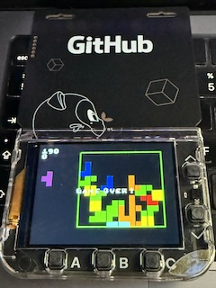

Badger Tetris
=============

Classic Tetris game running on a [GitHub/Pimoroni Badger](https://badger.github.io/) microcontroller.

Badger Python port by Richard Birkby

Original JavaScript [implementation](https://github.com/jakesgordon/javascript-tetris) - [Jake Gordon](https://jakesgordon.bsky.social)



Development
-----------

Install the recommended VSCode Extensions, including [raspberry-pi.raspberry-pi-pico](https://marketplace.visualstudio.com/items?itemName=raspberry-pi.raspberry-pi-pico).

Install Micropython stubs with:
```pip install -U micropython-rp2-rpi_pico_w-stubs --no-user --target ./typings```

Plug in the Pico.

Use ```MicroPico:Connect``` to connect to the Pico. Use Run command in VSCode status bar to execute the current file, alternatively double click the Reset button on badger and copy tetris/__init__.py to the device.


Licence
-------

[MIT](http://en.wikipedia.org/wiki/MIT_License) licensed
